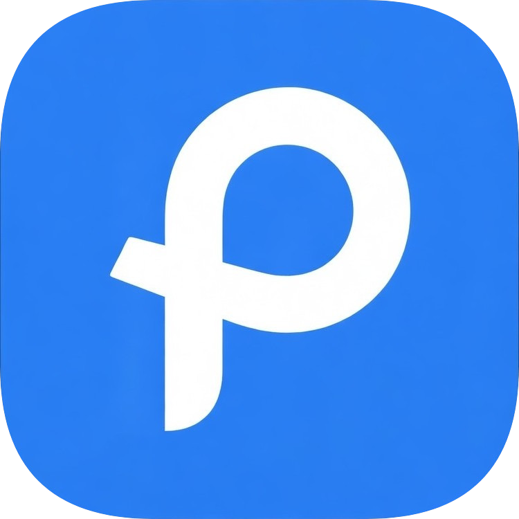

<div align="center">
  

  # 🐧 [PortfoliOS](https://development-portfolios.mark199850.workers.dev/)

  **A Linux Desktop-Like Web Application Portfolio**
  
  [](#)
  [](#)
  [](#)
  [](#)
  [](#)

  **[Live Demo](https://development-portfolios.mark199850.workers.dev/)**
</div>

---

## Overview

**PortfoliOS** is a highly interactive, Linux desktop-like personal portfolio built for the web. It was designed from the ground up to showcase my skills in frontend architecture, UI/UX design, and my passion for Linux systems.

Instead of a traditional scrolling webpage, visitors interact with a simulated desktop environment complete with window management, a taskbar, process monitoring, and custom native "apps" that detail my professional experience, education, and development projects.

## Live Environment

Experience the OS in your browser:  
🔗 **[PortfoliOS Live Deployment](https://development-portfolios.mark199850.workers.dev/)**

---

## Key Features & Engineering

This project is built to function like a mini operating system inside the browser, leveraging advanced React patterns and Redux Toolkit for global state synchronization:

* **Advanced Window Management (`useWindowManager`)**: Complete windowing system supporting dragging, z-index stacking (`WindowStack`), and dynamic content rendering.
* **Kernel & Process System (`kernel/`, `processSlice`)**: Simulated OS-level architecture that assigns PIDs to running applications and tracks system states in a centralized `OSStore`.
* **Daemons & Init System (`system/InitSystem`)**: Background service management that spawns daemons like `Clockd` on startup to keep system widgets continuously updated.
* **Native Applications**: Includes standalone apps like `AboutMe`, `Settings`, and a fully functional `SystemMonitor` for tracking processes and uptime.
* **Fluid UI & Theming**: Polished user interface built with strictly scoped SCSS modules, featuring customizable themes (`themeSlice`), desktop shortcuts and taskbar widgets.

---

## Tech Stack

* **Core:** React 18, TypeScript, Vite
* **State Management:** Redux Toolkit (Modular Slices: `hardwareSlice`, `processSlice`, `windowSlice`, `themeSlice`, `widgetSlice`)
* **Styling:** SCSS Modules
* **Hosting:** Cloudflare Workers

---

## Architecture & Folder Structure

As of the v0.7.0 release, PortfoliOS utilizes a domain-driven, highly scalable folder architecture to strictly separate system logic from application UI:

```text
src/
├── apps/           # Standalone windowed applications (AboutMe, Settings, SystemMonitor)
├── daemons/        # Background services running invisibly (e.g., Clockd for system clock)
├── kernel/         # Core state definitions, types, and the Redux OSStore
├── shell/          # Visual OS elements
├── system/         # Core system logic, InitSystem, and custom hooks (e.g., useWindowManager, useProcessManager)
├── widgets/        # Reusable taskbar and desktop widgets
└── shared/         # Reusable low-level UI components

```

---

## Getting Started

Want to run PortfoliOS locally? Follow these steps:

### Prerequisites

* Node.js (v18 or higher)
* npm or yarn

### Installation

1. **Clone the repository:**
```bash
git clone [https://github.com/mark199850/portfolios.git](https://github.com/mark199850/portfolios.git)
cd portfolios

```


2. **Install dependencies:**
```bash
npm install

```


3. **Start the development server:**
```bash
npm run dev

```


4. **Build for production:**
```bash
npm run build

```


---

## About the Author

**Márk Pócs** *Software Developer*

I am a software developer with over 2.5 years of experience, passionate about Linux, modern web technologies, and fluid user interfaces. I enjoy crafting seamless digital experiences that feel fast, intuitive, and alive.

---
